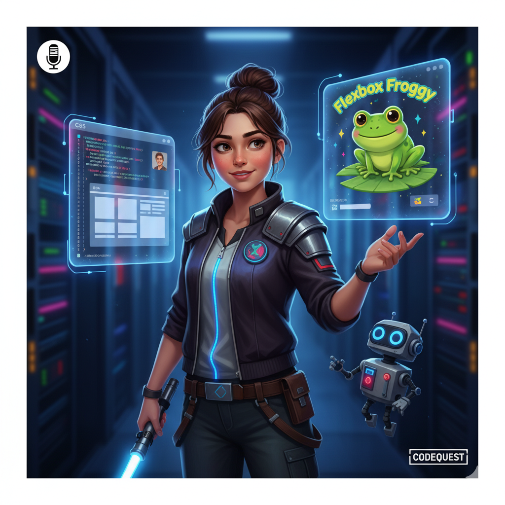

# O Império do Layout

<svg fill="none" width="1200" height="630" xmlns="http://www.w3.org/2000/svg">
  <!-- Background with gradient -->
  <defs>
    <linearGradient id="bgGradient" x1="0" y1="0" x2="1" y2="1">
      <stop offset="0%" stop-color="#0d1117" />
      <stop offset="100%" stop-color="#1c2025" />
    </linearGradient>
  </defs>
  <rect width="1200" height="630" fill="url(#bgGradient)"/>

  <!-- Main Title -->
  <text 
    x="50%" 
    y="50%" 
    text-anchor="middle" 
    fill="#c9d1d9" 
    font-size="70" 
    font-family="-apple-system, BlinkMacSystemFont, 'Segoe UI', Roboto, Helvetica, Arial, sans-serif, 'Apple Color Emoji', 'Segoe UI Emoji'"
    font-weight="bold">
    O Império do Layout
  </text>

  <!-- Divider with shadow -->
  <rect x="300" y="360" width="600" height="4" fill="#30363d" filter="url(#shadow)"/>

  <!-- Subtitle -->
  <text 
    x="50%" 
    y="70%" 
    text-anchor="middle" 
    fill="#f1e05a" 
    font-size="32" 
    font-family="-apple-system, BlinkMacSystemFont, 'Segoe UI', Roboto, Helvetica, Arial, sans-serif, 'Apple Color Emoji', 'Segoe UI Emoji'"
    font-style="italic">
    Onde o CSS sempre contra-ataca os bugs.
  </text>

  <!-- Decorative Icon -->
  <circle cx="50%" cy="20%" r="50" fill="#f1e05a" />
  <text 
    x="50%" 
    y="20%" 
    text-anchor="middle" 
    fill="#0d1117" 
    font-size="24" 
    font-family="Arial, sans-serif" 
    font-weight="bold">
    CSS
  </text>
</svg>

---

Atualizamos a capa do podcast para refletir a nova identidade visual. Confira a imagem acima!
