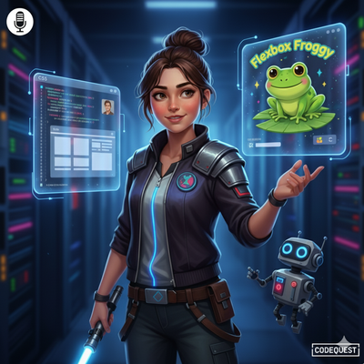

# O Império do Layout

<svg fill="none" width="200" height="200" xmlns="http://www.w3.org/2000/svg">
  <!-- Background with gradient -->
  <defs>
    <linearGradient id="bgGradient" x1="0" y1="0" x2="1" y2="1">
      <stop offset="0%" stop-color="#0d1117" />
      <stop offset="100%" stop-color="#1c2025" />
    </linearGradient>
  </defs>
  <rect width="200" height="200" fill="url(#bgGradient)"/>

---

## 🚀 Sobre o Podcast

E aí, Padawans do front-end! Bem-vindos ao **O Império do Layout**, o seu podcast focado em desbravar a galáxia do desenvolvimento web.

Nossa missão é ajudar você, que está começando sua jornada, a entender o universo do front-end de um jeito fácil, divertido e sem termos técnicos complicados. Falamos sobre dicas, novidades do mercado e as ferramentas que vão te ajudar a construir layouts sólidos e contra-atacar qualquer bug!

## 🎙️ Apresentação

  
   
  <strong>Michelle</strong>

Toda semana, eu, Michelle, serei sua guia pela Força do HTML, CSS e JavaScript, trazendo os códigos e as novidades direto dos confins da galáxia da tecnologia.

## 🎧 Onde Ouvir

* [🎧 SoudCloud](https://on.soundcloud.com/j5ul2c0QeFNM7TJfuD)

## 📜 Episódios

#### Episódio 01: O Cheat Code do CSS e o Sapo do Flexbox
* **Curiosidade 1 (CSS):** A regra de ouro do `box-sizing: border-box;` que todo dev precisa saber.
* **Curiosidade 2 (Ferramenta):** Como o **Flexbox Froggy** pode te ajudar a dominar o Flexbox de um jeito divertido.

*(Mais episódios em breve...)*
